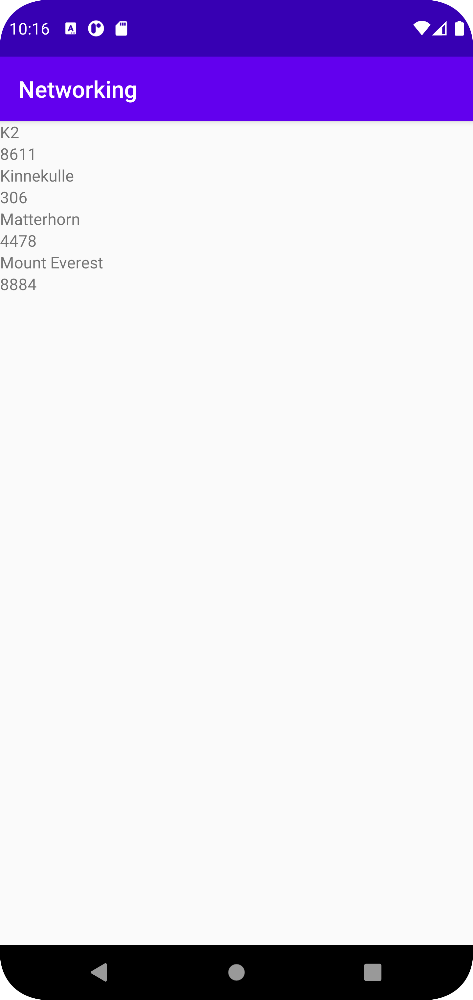

# Rapport

**Skriv din rapport här!**

Jag började med att skapa en recyclerview i activity_main.xml. Därefter skapade jag en till XML-fil för layouten av recyclerview som jag döpte till item_mountain-xml. Jag hämtade sedan all variabler i MainActivity som jag visste att jag skulle behöva. Jag skapade sedan Mountains-klassen och lade till getters och setters. Jag skapade även en klass som heter MyViewHolder och hämtade id för varje textview i min layout för min recyclerview. Slutligen skapade jag en adapter-klass som jag döpte till MyAdapter. Där lade jag till holders för varje variabel jag hade med och gjorde setText så att datan skrivs ut.

```
        new JsonTask(this).execute(JSON_URL);

        RecyclerView = findViewById(R.id.recycler_view);
        listOfMountains = new ArrayList<Mountains>();
        adapter = new MyAdapter(listOfMountains);
        RecyclerView.setAdapter(adapter);
        RecyclerView.setLayoutManager(new LinearLayoutManager(this));
```
Alla variabler har deklarerats innan och initieras de i MainActivity.

```
    @Override
    public void onBindViewHolder(@NonNull MyViewHolder holder, int position) {
        holder.name.setText(listOfMountains.get(position).getName());
        holder.size.setText(String.valueOf(listOfMountains.get(position).getSize()));
    }
```
Denna kod är hämtad från min adapter-klass och det är här jag har användt setText. Notera att jag var tvungen att ta String.valueOf på size p.g.a. att det är en integer. 




